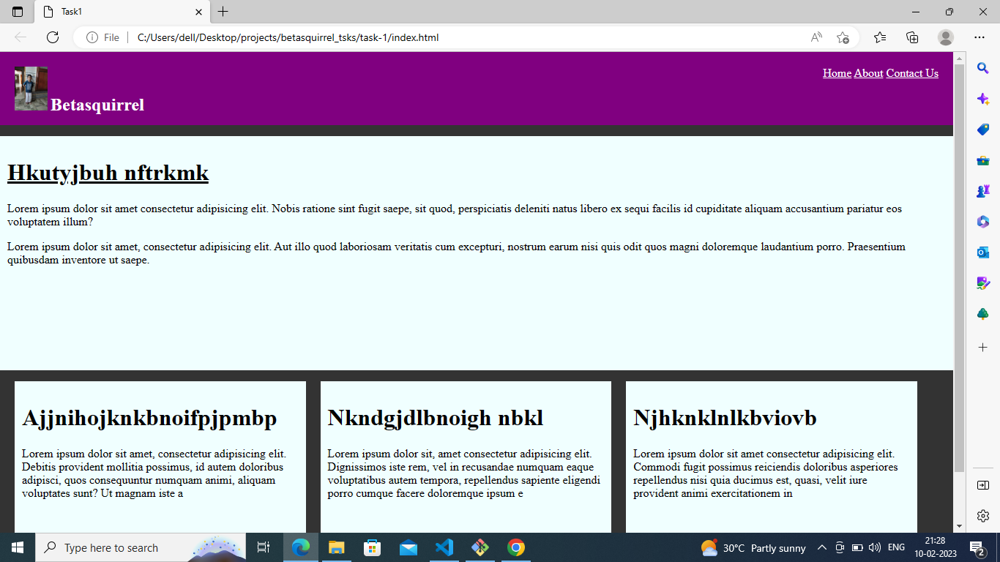
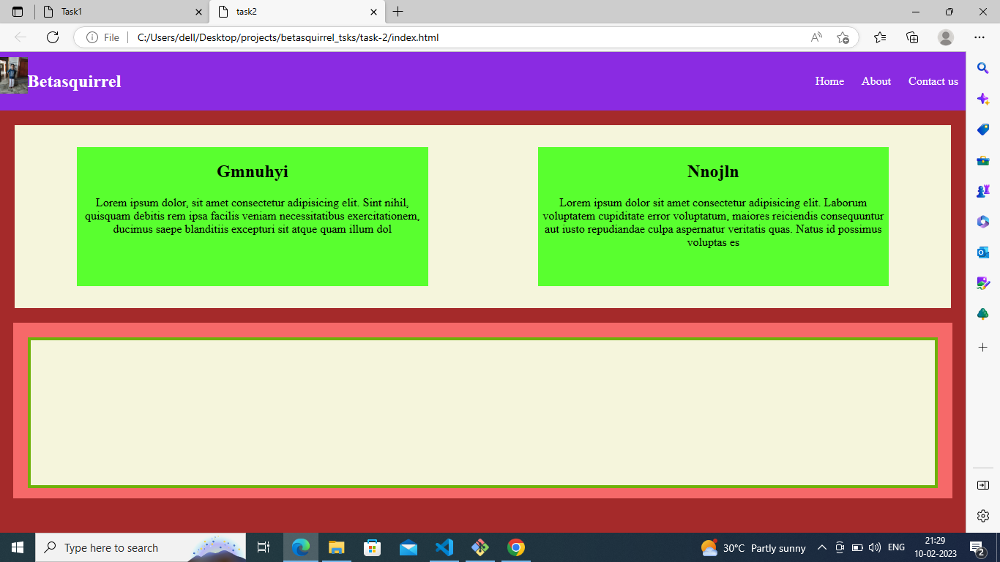
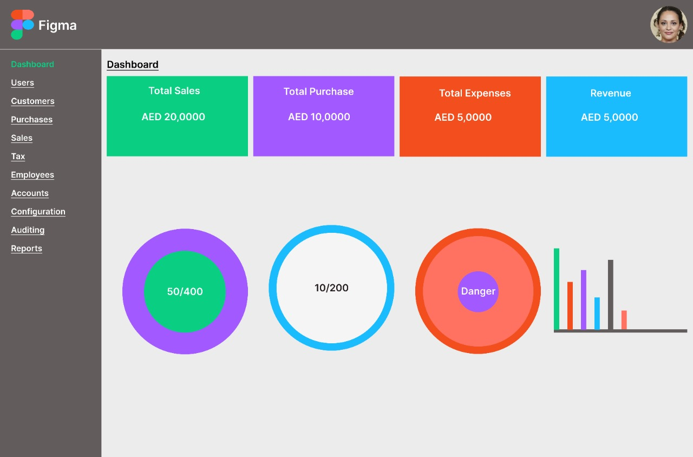
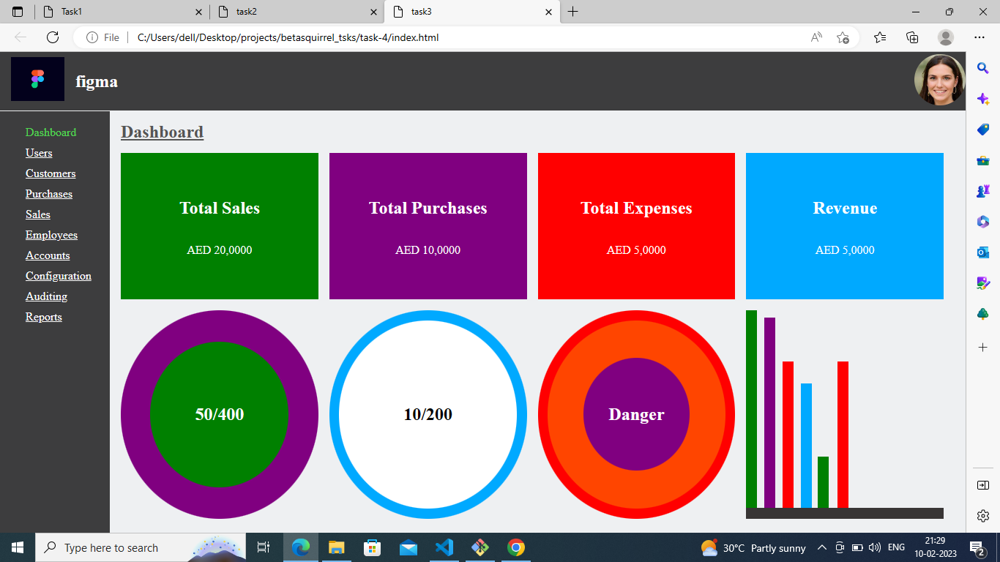

# betasquirrel_tsks

Tasks from betasquirrel

## Tasks

| Requirements                | Output                    |
| --------------------------- | ------------------------- |
|  |  |
|  |  |
|  |  |

## Task3

Read the below pages and attend the test

- [HTML](https:/www.w3schools.com/html/default.asp)
- [Elements](https://www.w3schools.com/html/html_elements.asp)
- [Attributes](https://www.w3schools.com/html/html_attributes.asp)
- [Headings](https://www.w3schools.com/html/html_headings.asp)
- [Paragraphs](https://www.w3schools.com/html/html_paragraphs.asp)
- [Styles](https://www.w3schools.com/html/html_styles.asp)
- [Formatting](https://www.w3schools.com/html/html_formatting.asp)
- [Quotations](https://www.w3schools.com/html/html_quotations_elemens.asp)
- [Comments](https://www.w3schools.com/html/html_comments.asp)
- [Colours](https://www.w3schools.com/html/html_colors.asp)
- [css](https://www.w3schools.com/html/html_css.asp)
- [Links](https://www.w3schools.com/html/html_links.asp)
- [Images](https://www.w3schools.com/html/html_images.asp)

## Linux Commands

- `cd` - Change corrent diarectory. Ex: `cd Desktop`
- `ls` -List contents of a directory. Ex: `ls` list out available diarectory
- `pwd` -Dispay current working directory path.
- `cat` -Disply contents of a file.Ex: `cat README.md`
- `clear`-To clear the screen. EX: `clear`
- `mkdir` -To create new directory. EX: `mkdir projects`

## Git Commands

1. `git config` -Configure git user.Ex: `git config --global user.name "githubname"`
2. `git clone` -Clone a remote git repo to your local. Ex: `git clone URL`
3. `git add` -Add your file changes to git.Ex: `git add README.md`
4. `git commit`-Commit changes to git.Ex: `git commit -m "initial commit"`
5. `git push` -Push your local commits to remote repo.Ex `git push origin main`

## Task 5

- [Favicon](https://www.w3schools.com/html/favicon_asp)
- [HTML Tables](https://www.w3schools.com/html/html_tables.asp)
- [HTML Table Headers](https://www.w3schools.com/html/html_table_headers.asp)
- [HTML Table Borders](https://www.w3schools.com/html/html_table_borders.asp)
- [HTML Table Sizes](https://www.w3schools.com/html/html_table_sizes.asp)
- [HTML Table Padding&Spasing](https://www.w3schools.com/html/html_table_padding_spacing.asp)
- [HTML Table Colspan&Rowpan](https://www.w3schools.com/html/html_table_colspan_rowspan.asp)
- [HTML Table Styling](https://www.w3schools.com/html/html_table_styling.asp)
- [HTML Table Colgroup](https://www.w3schools.com/html/html_table_colgroup.asp)
